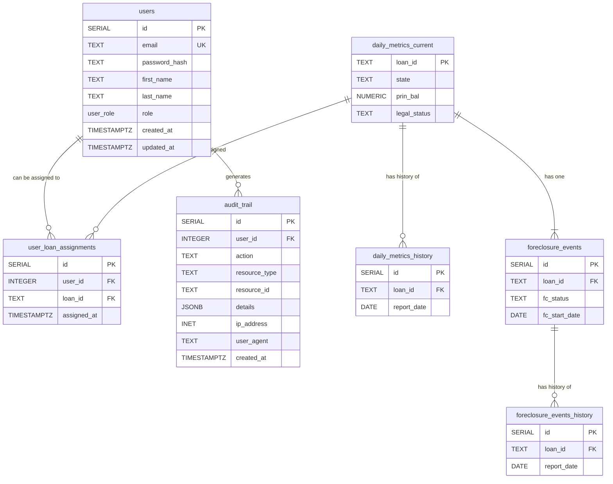
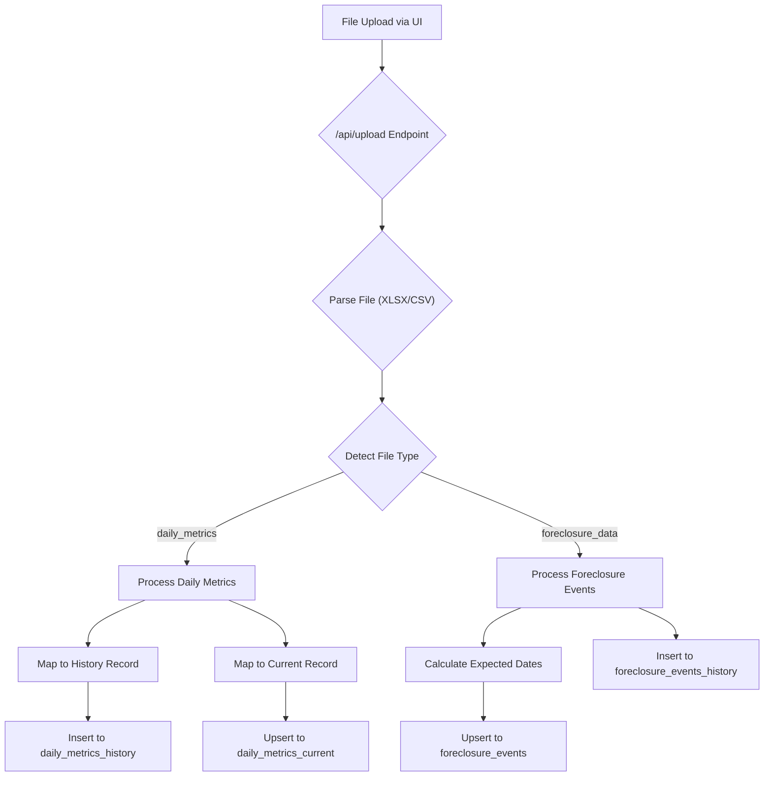
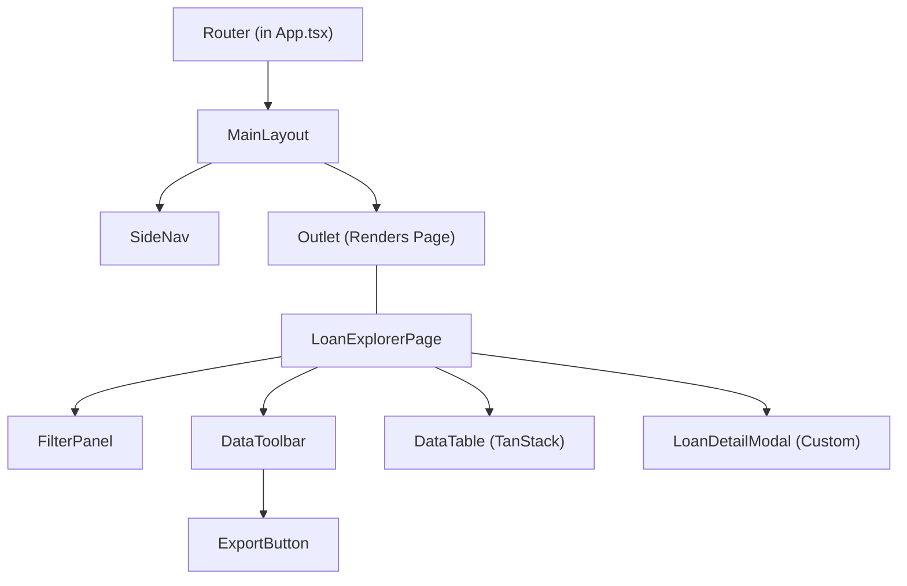

# NPLVision Technical Documentation

*This document serves as the single source of truth for the technical architecture, data models, and core logic of the NPLVision platform. It is a living document and should be updated as new features are built.*

---

## 1. High-Level Architecture

The NPLVision platform is a modern, full-stack web application designed for scalability and maintainability. It follows a standard three-tier architecture composed of a frontend client, a backend API server, and a relational database.

### 1.1. Core Components

* **Frontend (Client):** A single-page application (SPA) built with **React** and **Vite**. It is written in **TypeScript** and uses **Tailwind CSS** for styling and `shadcn/ui` for its component library. The frontend is responsible for all user interface rendering and state management.

* **Backend (Server):** A RESTful API server built with **Node.js** and the **Express** framework. It is written in **TypeScript** and is responsible for all business logic, data processing, and communication with the database.

* **Database:** A **PostgreSQL** database that serves as the persistent data store for all loan information, historical data, and user-generated content.

### 1.2. Deployment & Hosting (Render.com)

The entire platform is deployed on **Render.com** as two distinct services, which allows for independent scaling and deployment:

1.  **Frontend Service:** Serves the static, compiled React application.
2.  **Backend Service:** Runs the Node.js API server.

This separation ensures a clean, decoupled architecture where the frontend communicates with the backend exclusively through defined API endpoints.

---

## 2. Database Schema

The PostgreSQL database is the system's single source of truth. It is designed around a "current vs. history" model to provide both real-time snapshots and a full audit trail for trend analysis.

### 2.1. Purpose & Rationale

The database is designed around a "Current vs. History" model to serve two distinct, critical functions: speed for the user interface and depth for long-term analysis.

* **The `_current` Tables (For Speed):** Tables like `daily_metrics_current` and `foreclosure_events` are optimized for performance. They contain only the single, most recent record for each loan. This allows the frontend's Loan Explorer to quickly fetch and display a "snapshot" of the entire portfolio without having to sift through historical data.

* **The `_history` Tables (For Intelligence):** Tables like `daily_metrics_history` and `foreclosure_events_history` are designed to be our most valuable long-term data asset. By storing a record from *every* file upload, we create a complete, immutable audit trail. This is the foundation of our "Benchmark Flywheel," allowing us to analyze performance over time, compare actuals vs. expecteds, and eventually train predictive models.

### 2.2. The "Current vs. History" Model

For key data entities like loan metrics and foreclosure events, we maintain two tables:

* **`_current` table:** This table contains only one row per unique `loan_id`. It is always updated with the absolute latest information from the most recent file upload, providing a quick "snapshot" view of the portfolio. This table powers the main Loan Explorer UI.
* **`_history` table:** This table stores a record from *every* file upload, uniquely identified by a combination of `loan_id` and `report_date`. This provides a complete, immutable audit trail, which is essential for historical analysis and our future "Benchmark Flywheel."

---

### 2.3. Entity-Relationship Diagram (ERD)

This diagram illustrates the primary relationships between the core data tables.



---

### 2.4. Key Tables

#### `daily_metrics_current`

* **Purpose:** Stores the most recent snapshot of core financial and status information for each loan. This is the primary table used by the `/api/v2/loans` endpoint.
* **Schema:**
    ```sql
    CREATE TABLE daily_metrics_current (
        loan_id TEXT PRIMARY KEY,
        investor_name TEXT,
        first_name TEXT,
        last_name TEXT,
        address TEXT,
        city TEXT,
        state TEXT,
        zip TEXT,
        prin_bal NUMERIC(15, 2),
        int_rate NUMERIC(8, 6),
        next_pymt_due DATE,
        last_pymt_received DATE,
        loan_type TEXT,
        legal_status TEXT,
        lien_pos TEXT,
        -- ... other relevant columns ...
        updated_at TIMESTAMPTZ DEFAULT now()
    );
    ```

#### `foreclosure_events`

* **Purpose:** Stores the current, active foreclosure details for any loan currently in the foreclosure process. A loan will only have one entry here. This table is joined with `daily_metrics_current` to provide foreclosure context.
* **Schema:**
    ```sql
    CREATE TABLE foreclosure_events (
      id SERIAL PRIMARY KEY,
      loan_id TEXT NOT NULL UNIQUE,
      fc_status TEXT,
      fc_jurisdiction TEXT,
      fc_start_date DATE,
      -- Actual Milestone Dates
      referral_date DATE,
      title_ordered_date DATE,
      title_received_date DATE,
      complaint_filed_date DATE,
      service_completed_date DATE,
      judgment_date DATE,
      sale_scheduled_date DATE,
      sale_held_date DATE,
      -- Expected Milestone Dates (Calculated on Ingest)
      referral_expected_completion_date DATE,
      title_ordered_expected_completion_date DATE,
      title_received_expected_completion_date DATE,
      complaint_filed_expected_completion_date DATE,
      service_completed_expected_completion_date DATE,
      judgment_expected_completion_date DATE,
      sale_scheduled_expected_completion_date DATE,
      sale_held_expected_completion_date DATE,
      -- ... other relevant columns ...
      updated_at TIMESTAMPTZ DEFAULT now()
    );
    ```
*(Note: The corresponding `_history` tables have identical columns but also include a `report_date` field.)*

### 2.5. User & Authentication Tables

#### `users`

* **Purpose:** Stores user account information including authentication credentials and role-based access control. This table serves as the foundation for the authentication system.
* **Schema:**
    ```sql
    CREATE TYPE user_role AS ENUM ('super_user', 'admin', 'manager', 'user');
    
    CREATE TABLE users (
        id SERIAL PRIMARY KEY,
        email TEXT UNIQUE NOT NULL,
        password_hash TEXT NOT NULL,
        first_name TEXT,
        last_name TEXT,
        role user_role NOT NULL DEFAULT 'user',
        created_at TIMESTAMPTZ DEFAULT NOW(),
        updated_at TIMESTAMPTZ DEFAULT NOW()
    );
    ```

#### `user_loan_assignments` *(Future Implementation)*

* **Purpose:** Enables role-based data access by defining which users can view specific loans or loan portfolios. This table will support multi-tenant functionality.
* **Schema:**
    ```sql
    CREATE TABLE user_loan_assignments (
        id SERIAL PRIMARY KEY,
        user_id INTEGER NOT NULL REFERENCES users(id) ON DELETE CASCADE,
        loan_id TEXT NOT NULL,
        assigned_at TIMESTAMPTZ DEFAULT NOW(),
        UNIQUE(user_id, loan_id)
    );
    ```

#### `audit_trail` *(Future Implementation)*

* **Purpose:** Maintains a comprehensive log of all user actions within the system for security, compliance, and debugging purposes.
* **Schema:**
    ```sql
    CREATE TABLE audit_trail (
        id SERIAL PRIMARY KEY,
        user_id INTEGER REFERENCES users(id) ON DELETE SET NULL,
        action TEXT NOT NULL,
        resource_type TEXT NOT NULL,
        resource_id TEXT,
        details JSONB,
        ip_address INET,
        user_agent TEXT,
        created_at TIMESTAMPTZ DEFAULT NOW()
    );
    ```

---

## 3. Backend Services & Logic

The backend is responsible for all business logic, data processing, and API services. It is designed to be a "smart" service that provides clean, processed data to a "dumb" frontend.

### 3.1. Purpose & Rationale

The backend is designed as a **"Smart Service Layer"**. The core principle is to centralize all complex business logic, data processing, and third-party integrations on the server. This allows the frontend to remain a "dumb" presentation layer, making it simpler, faster, and easier to maintain.

* **Encapsulated Logic (`/services`):** We separate distinct business functions into their own service files (e.g., `foreclosureService.ts`, `currentHistoryService.ts`). This makes the code modular, easier to test, and allows us to reuse complex logic across multiple API endpoints if needed.
* **Purpose-Built Endpoints (`/routes`):** Instead of one generic API endpoint, we create specific routes that are tailored to the exact needs of a UI component. For example, the `/api/v2/loans` endpoint is designed to efficiently feed the main data table, while the `/api/loans/:loanId/foreclosure-timeline` endpoint performs a more complex calculation for the specific needs of the detail modal. This ensures the UI is always fast and never has to fetch more data than it needs.

### 3.2. Data Ingestion Pipeline (`/api/upload`)

The ingestion pipeline is the entry point for all portfolio data. It's a multi-step process designed to be robust and resilient.

**Flowchart:**


**Key Steps:**

1. **File Parsing:** The endpoint accepts `.xlsx` or `.csv` files and uses the `multer` and `xlsx` libraries to parse the file buffer into a raw JSON format.
2. **File Type Detection (`fileTypeDetector.ts`):** The system analyzes the column headers of the uploaded file to determine if it is a `daily_metrics` file or a `foreclosure_data` file. It uses a confidence score based on matching key headers.
3. **Data Processing:** Based on the detected file type, the request is routed to the appropriate processing logic.
4. **Data Mapping (`columnMappers.ts`):** Raw data from each row is mapped to our standardized database schemas. This step includes data cleaning functions (`cleanCurrency`, `parseExcelDate`, etc.).
5. **Database Insertion (`currentHistoryService.ts`):** The mapped data is inserted into the database, following our "Current vs. History" model. The `_history` tables receive a new record for every upload, while the `_current` tables are updated with only the latest data for each loan.

### 3.3. Foreclosure Timeline Service (`foreclosureService.ts`)

This service contains the core business intelligence for our foreclosure tracking.

**`getForeclosureTimeline` Function:** This is the primary function called by the API. It takes a `loan_id` and performs the following steps:
1. Fetches the loan's state from the `daily_metrics_current` table.
2. Fetches the corresponding `foreclosure_events` record, which contains all the actual and expected milestone dates.
3. Loads the `fcl_milestones_by_state.json` ruleset file.
4. Looks up the correct milestone template for the loan's state and jurisdiction (judicial vs. non-judicial).
5. Combines the template with the actual/expected data from the database to create a complete, ordered timeline.

**Expected Date Calculation:** The service also includes logic to dynamically calculate a full chain of expected completion dates upon ingestion, making it a predictive tool.

### 3.4. API Endpoints (`loans.ts`)

These are the key routes that serve data to the frontend.

* **`GET /api/v2/loans`:** This is the primary endpoint for the Loan Explorer. It performs a LEFT JOIN on `daily_metrics_current` and `foreclosure_events` to provide a single, rich list of all loans with their current status.
* **`GET /api/v2/loans/:loanId`:** Fetches the full, detailed record for a single loan from the `daily_metrics_current` table to populate the top sections of the Loan Detail Modal.
* **`GET /api/loans/:loanId/foreclosure-timeline`:** Calls the `getForeclosureTimeline` service to provide the detailed, calculated timeline for a single loan to populate the bottom section of the Loan Detail Modal.

### 3.5. Authentication Service & Middleware

The authentication system provides secure user management and session handling using industry-standard JWT tokens and bcrypt password hashing.

#### Authentication Routes (`/api/auth`)

* **`POST /api/auth/register`:** Creates new user accounts with email validation and secure password hashing using bcrypt with a salt rounds configuration.
* **`POST /api/auth/login`:** Authenticates users and returns a JWT token containing user ID, email, and role information with a 24-hour expiration.
* **Token Structure:** JWT tokens include essential user information (id, email, role) and are signed with a server-side secret key.

#### Authentication Middleware (`authMiddleware.ts`)

* **Purpose:** Protects API endpoints by validating JWT tokens and extracting user information for use in route handlers.
* **Implementation:** Verifies token signatures, checks expiration, and attaches user data to the request object.
* **Usage:** Applied to all data-fetching endpoints (`/api/v2/loans`, `/api/loans/:loanId`, etc.) to ensure only authenticated users can access loan data.

#### Security Features

* **Password Security:** Uses bcrypt with configurable salt rounds for secure password hashing.
* **JWT Security:** Tokens are signed with a secret key and include expiration times to prevent unauthorized access.
* **Route Protection:** All sensitive endpoints require valid authentication tokens.
* **Role-Based Foundation:** Database schema includes role enum types (`super_user`, `admin`, `manager`, `user`) for future authorization enhancements.

<!-- end list -->

---

## 4. Frontend Architecture

The frontend is a modern Single-Page Application (SPA) built with React and Vite. It is designed to be a "dumb" client that receives clean, processed data from the backend and focuses solely on presentation and user interaction.

### 4.1. Purpose & Rationale

The frontend is designed with two core principles in mind: separation of concerns and component-based architecture.

**Dumb Components, Smart Containers:** We follow a pattern where high-level "page" components (like `LoanExplorerPage`) are "smart"—they are responsible for fetching data and managing all the state for that view. They then pass this data down as props to smaller, "dumb" presentational components (like `DataToolbar` or `FilterPanel`) whose only job is to display that data. This makes our code easier to debug, as logic is centralized, and our UI components are highly reusable.

**Centralized Layout:** The `MainLayout.tsx` component acts as the "application shell," providing a consistent navigation experience across all pages. This prevents us from having to rebuild the navigation on every page and makes global changes (like adding a new nav link) trivial.

### 4.2. Component Hierarchy & Layout

The application uses a responsive shell structure, managed by `MainLayout.tsx`, which provides a persistent sidebar for navigation on desktop screens and a slide-out drawer on mobile.

**Component Diagram:**



**Key Components:**

* **`App.tsx`:** The root of the application. Its only job is to set up the `react-router-dom` router and define the relationship between the `MainLayout` and the individual pages.

* **`MainLayout.tsx`:** The main application shell. It uses Tailwind CSS's responsive prefixes to render a persistent `SideNav` on large screens (`lg:flex`) and a hidden `Sheet`-based drawer for mobile. The `<Outlet>` from React Router is used to render the active page's content in the main content area.

* **`LoanExplorerPage.tsx`:** This is the most complex "container" component. It is responsible for:
  - **Data Fetching:** Using a `useEffect` hook to call the `/api/v2/loans` endpoint via `axios`.
  - **State Management:** Using `useState` hooks to manage all page-level state, including the full list of loans, the active filters, sorting state, and the currently selected loan for the modal.
  - **Derived Data:** Using `useMemo` hooks to efficiently calculate unique values for the filter panel dropdowns (e.g., `uniqueStates`, `uniqueInvestors`).
  - **Component Composition:** Rendering the primary child components (`FilterPanel`, `DataToolbar`, `DataTable`) and passing them the necessary data and callback functions as props.

### 4.3. Core Data Flow (Loan Explorer)

1. **Initial Load:** `LoanExplorerPage` mounts, and its `useEffect` hook fires to call the `/api/v2/loans` endpoint. The full, unfiltered list of loans is stored in the `loans` state variable.

2. **Filtering:** The user interacts with the controls in the `FilterPanel`. All selections are managed within the `FilterPanel's` own internal state.

3. **Apply Action:** When the user clicks the "Apply" button, the `FilterPanel` invokes the `onApplyFilters` callback prop, passing its current internal filter state up to the `LoanExplorerPage`.

4. **State Update & Re-render:** The `LoanExplorerPage` updates its `activeFilters` state with the data received from the callback. This state change triggers a re-render.

5. **Memoized Calculation:** The `filteredData` `useMemo` hook, which depends on `activeFilters`, re-runs. It filters the master `loans` array based on the new criteria and returns a new array of only the matching loans.

6. **Table Update:** The TanStack Table component receives the new, smaller `filteredData` array as its `data` prop and automatically re-renders to show only the filtered results.

### 4.4. Frontend Authentication

The frontend authentication system provides a seamless login/registration experience with centralized state management using React Context API.

#### Authentication Components

* **`LoginPage.tsx`:** Provides a clean, professional login interface with email/password fields and error handling.
* **`RegisterPage.tsx`:** Handles new user registration with form validation and user feedback.
* **`AuthContext.tsx`:** Centralized authentication state management using React Context API, providing login/logout functions and user session data to all components.
* **`ProtectedRoute.tsx`:** Higher-order component that ensures only authenticated users can access protected pages, automatically redirecting unauthenticated users to the login page.

#### Authentication Flow

1. **Initial Load:** The AuthContext checks for existing JWT tokens in localStorage and validates them on application startup.
2. **Login Process:** User credentials are submitted to `/api/auth/login`, and successful authentication stores the JWT token and user information in localStorage and Context state.
3. **Automatic Headers:** Axios interceptors automatically include JWT tokens in all API requests to protected endpoints.
4. **Route Protection:** The ProtectedRoute component wraps all data pages (LoanExplorerPage, UploadPage, DashboardPage) to ensure authentication is required.
5. **Session Persistence:** User sessions persist across browser refreshes using localStorage token storage.
6. **Logout:** The logout function clears stored tokens and redirects users to the login page.

#### Security Features

* **Token Management:** JWT tokens are stored securely in localStorage and automatically included in API requests.
* **Error Handling:** Comprehensive error handling for authentication failures, network issues, and invalid credentials.
* **User Feedback:** Clear success/error messages and loading states during authentication processes.
* **Automatic Redirects:** Seamless redirects between login and protected pages based on authentication status.

---

## 5. Business Logic & Intelligence

The NPLVision platform includes sophisticated business logic for analyzing foreclosure timelines and determining loan performance status. This intelligence is centralized in shared utility functions to ensure consistency across the application.

### 5.1. Timeline Intelligence (`timelineUtils.ts`)

The timeline intelligence system provides sophisticated analysis of foreclosure progression using cumulative variance calculations to determine whether loans are "On Track" or "Overdue" relative to expected performance benchmarks.

#### Core Functions

* **`getOverallLoanStatus(loan: Loan)`:** The primary function that determines a loan's overall timeline status by calculating cumulative variance across all foreclosure milestones.

* **`getMilestoneStatus(actualDateStr, expectedDateStr)`:** Determines the status of individual foreclosure milestones, returning values like 'COMPLETED_ON_TIME', 'COMPLETED_LATE', 'PENDING_OVERDUE', or 'PENDING_ON_TRACK'.

#### Cumulative Variance Algorithm

The system uses a sophisticated cumulative variance calculation that:

1. **Iterates through state-specific foreclosure milestones** in chronological order based on the loan's state and jurisdiction (judicial vs. non-judicial).

2. **Calculates step-by-step variance** by comparing actual days taken for each completed milestone against the preferred benchmark days defined in `fcl_milestones_by_state.json`.

3. **Accumulates variance across milestones** to determine overall loan performance, where positive variance indicates delays and negative variance indicates faster-than-expected progress.

4. **Handles pending milestones** by calculating how long the loan has been waiting at the current step against the expected duration for that milestone.

5. **Uses a fixed calculation date** (2025-06-26) for consistent results across the application.

#### State-Based Configuration

The system leverages the `fcl_milestones_by_state.json` configuration file which defines:

* **Judicial vs. Non-Judicial pathways** for each state
* **Preferred timeline benchmarks** in days for each milestone
* **Database column mappings** to actual completion dates
* **Sequential milestone ordering** for proper variance calculation

#### Example Implementation

```typescript
// Calculate cumulative variance across all milestones
let cumulativeVariance = 0;
let previousMilestoneActualDate = new Date(loan.fc_start_date);

for (const milestone of milestones) {
  const actualCompletionDateStr = loan[milestone.db_column as keyof Loan];
  
  if (actualCompletionDateStr) {
    // Calculate variance for completed milestone
    const currentMilestoneActualDate = new Date(actualCompletionDateStr);
    const actualDaysForStep = dateDiffInDays(previousMilestoneActualDate, currentMilestoneActualDate);
    const expectedDaysForStep = milestone.preferredDays;
    cumulativeVariance += (actualDaysForStep - expectedDaysForStep);
    previousMilestoneActualDate = currentMilestoneActualDate;
  } else {
    // Calculate variance for first pending milestone
    const actualDaysWaiting = dateDiffInDays(previousMilestoneActualDate, MOCK_TODAY);
    const expectedDaysForStep = milestone.preferredDays;
    cumulativeVariance += (actualDaysWaiting - expectedDaysForStep);
    break; 
  }
}

// Final status determination
return cumulativeVariance > 0 ? 'Overdue' : 'On Track';
```

### 5.2. Foreclosure Filter Integration

The timeline intelligence integrates seamlessly with the Loan Explorer's filter system:

* **Timeline Status Filter:** Users can filter loans by "On Track" or "Overdue" status using the `getOverallLoanStatus` function.
* **Real-time Calculation:** Timeline status is calculated dynamically based on current loan data and milestone completion status.
* **Performance Optimization:** The calculation is performed client-side using memoized data to ensure responsive filtering.
