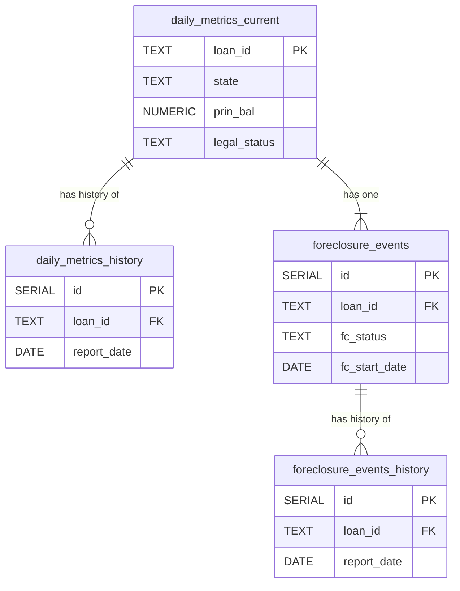
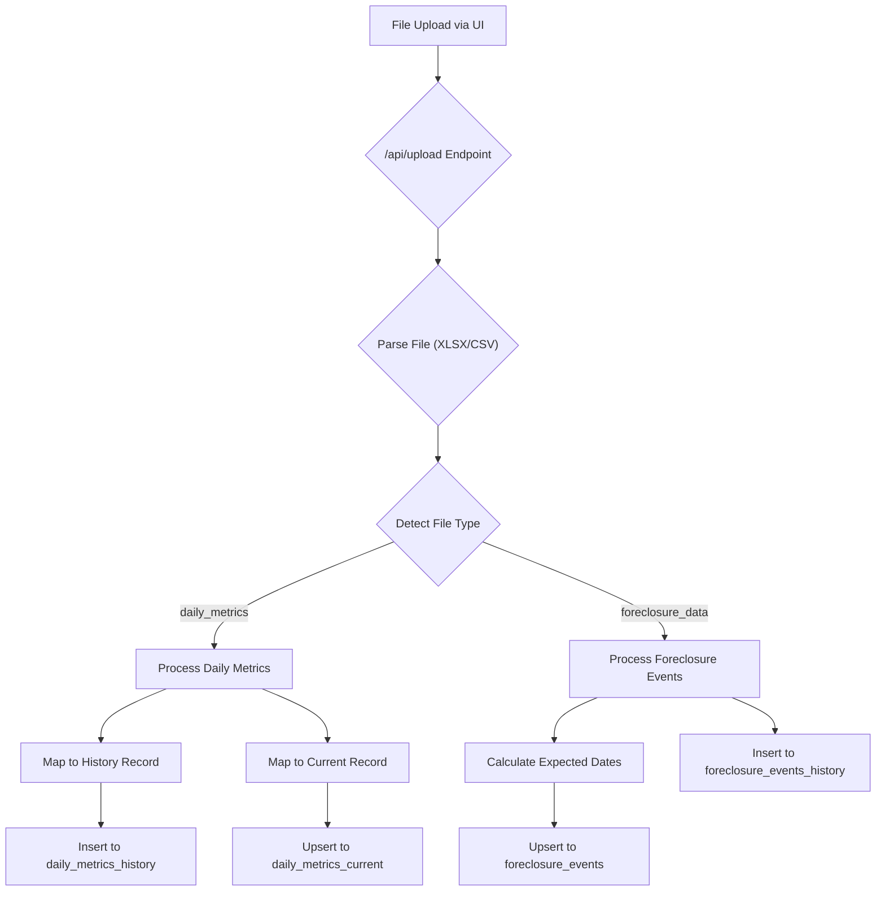

# NPLVision Technical Documentation

*This document serves as the single source of truth for the technical architecture, data models, and core logic of the NPLVision platform. It is a living document and should be updated as new features are built.*

---

## 1. High-Level Architecture

The NPLVision platform is a modern, full-stack web application designed for scalability and maintainability. It follows a standard three-tier architecture composed of a frontend client, a backend API server, and a relational database.

### 1.1. Core Components

* **Frontend (Client):** A single-page application (SPA) built with **React** and **Vite**. It is written in **TypeScript** and uses **Tailwind CSS** for styling and `shadcn/ui` for its component library. The frontend is responsible for all user interface rendering and state management.

* **Backend (Server):** A RESTful API server built with **Node.js** and the **Express** framework. It is written in **TypeScript** and is responsible for all business logic, data processing, and communication with the database.

* **Database:** A **PostgreSQL** database that serves as the persistent data store for all loan information, historical data, and user-generated content.

### 1.2. Deployment & Hosting (Render.com)

The entire platform is deployed on **Render.com** as two distinct services, which allows for independent scaling and deployment:

1.  **Frontend Service:** Serves the static, compiled React application.
2.  **Backend Service:** Runs the Node.js API server.

This separation ensures a clean, decoupled architecture where the frontend communicates with the backend exclusively through defined API endpoints.

---

## 2. Database Schema

The PostgreSQL database is the system's single source of truth. It is designed around a "current vs. history" model to provide both real-time snapshots and a full audit trail for trend analysis.

### 2.1. The "Current vs. History" Model

For key data entities like loan metrics and foreclosure events, we maintain two tables:

* **`_current` table:** This table contains only one row per unique `loan_id`. It is always updated with the absolute latest information from the most recent file upload, providing a quick "snapshot" view of the portfolio. This table powers the main Loan Explorer UI.
* **`_history` table:** This table stores a record from *every* file upload, uniquely identified by a combination of `loan_id` and `report_date`. This provides a complete, immutable audit trail, which is essential for historical analysis and our future "Benchmark Flywheel."

---

### 2.2. Entity-Relationship Diagram (ERD)

This diagram illustrates the primary relationships between the core data tables.



---

### 2.3. Key Tables

#### `daily_metrics_current`

* **Purpose:** Stores the most recent snapshot of core financial and status information for each loan. This is the primary table used by the `/api/v2/loans` endpoint.
* **Schema:**
    ```sql
    CREATE TABLE daily_metrics_current (
        loan_id TEXT PRIMARY KEY,
        investor_name TEXT,
        first_name TEXT,
        last_name TEXT,
        address TEXT,
        city TEXT,
        state TEXT,
        zip TEXT,
        prin_bal NUMERIC(15, 2),
        int_rate NUMERIC(8, 6),
        next_pymt_due DATE,
        last_pymt_received DATE,
        loan_type TEXT,
        legal_status TEXT,
        lien_pos TEXT,
        -- ... other relevant columns ...
        updated_at TIMESTAMPTZ DEFAULT now()
    );
    ```

#### `foreclosure_events`

* **Purpose:** Stores the current, active foreclosure details for any loan currently in the foreclosure process. A loan will only have one entry here. This table is joined with `daily_metrics_current` to provide foreclosure context.
* **Schema:**
    ```sql
    CREATE TABLE foreclosure_events (
      id SERIAL PRIMARY KEY,
      loan_id TEXT NOT NULL UNIQUE,
      fc_status TEXT,
      fc_jurisdiction TEXT,
      fc_start_date DATE,
      -- Actual Milestone Dates
      referral_date DATE,
      title_ordered_date DATE,
      title_received_date DATE,
      complaint_filed_date DATE,
      service_completed_date DATE,
      judgment_date DATE,
      sale_scheduled_date DATE,
      sale_held_date DATE,
      -- Expected Milestone Dates (Calculated on Ingest)
      referral_expected_completion_date DATE,
      title_ordered_expected_completion_date DATE,
      title_received_expected_completion_date DATE,
      complaint_filed_expected_completion_date DATE,
      service_completed_expected_completion_date DATE,
      judgment_expected_completion_date DATE,
      sale_scheduled_expected_completion_date DATE,
      sale_held_expected_completion_date DATE,
      -- ... other relevant columns ...
      updated_at TIMESTAMPTZ DEFAULT now()
    );
    ```
*(Note: The corresponding `_history` tables have identical columns but also include a `report_date` field.)*

---

## 3. Backend Services & Logic

The backend is responsible for all business logic, data processing, and API services. It is designed to be a "smart" service that provides clean, processed data to a "dumb" frontend.

### 3.1. Data Ingestion Pipeline (`/api/upload`)

The ingestion pipeline is the entry point for all portfolio data. It's a multi-step process designed to be robust and resilient.

**Flowchart:**


**Key Steps:**

1. **File Parsing:** The endpoint accepts `.xlsx` or `.csv` files and uses the `multer` and `xlsx` libraries to parse the file buffer into a raw JSON format.
2. **File Type Detection (`fileTypeDetector.ts`):** The system analyzes the column headers of the uploaded file to determine if it is a `daily_metrics` file or a `foreclosure_data` file. It uses a confidence score based on matching key headers.
3. **Data Processing:** Based on the detected file type, the request is routed to the appropriate processing logic.
4. **Data Mapping (`columnMappers.ts`):** Raw data from each row is mapped to our standardized database schemas. This step includes data cleaning functions (`cleanCurrency`, `parseExcelDate`, etc.).
5. **Database Insertion (`currentHistoryService.ts`):** The mapped data is inserted into the database, following our "Current vs. History" model. The `_history` tables receive a new record for every upload, while the `_current` tables are updated with only the latest data for each loan.

### 3.2. Foreclosure Timeline Service (`foreclosureService.ts`)

This service contains the core business intelligence for our foreclosure tracking.

**`getForeclosureTimeline` Function:** This is the primary function called by the API. It takes a `loan_id` and performs the following steps:
1. Fetches the loan's state from the `daily_metrics_current` table.
2. Fetches the corresponding `foreclosure_events` record, which contains all the actual and expected milestone dates.
3. Loads the `fcl_milestones_by_state.json` ruleset file.
4. Looks up the correct milestone template for the loan's state and jurisdiction (judicial vs. non-judicial).
5. Combines the template with the actual/expected data from the database to create a complete, ordered timeline.

**Expected Date Calculation:** The service also includes logic to dynamically calculate a full chain of expected completion dates upon ingestion, making it a predictive tool.

### 3.3. API Endpoints (`loans.ts`)

These are the key routes that serve data to the frontend.

* **`GET /api/v2/loans`:** This is the primary endpoint for the Loan Explorer. It performs a LEFT JOIN on `daily_metrics_current` and `foreclosure_events` to provide a single, rich list of all loans with their current status.
* **`GET /api/v2/loans/:loanId`:** Fetches the full, detailed record for a single loan from the `daily_metrics_current` table to populate the top sections of the Loan Detail Modal.
* **`GET /api/loans/:loanId/foreclosure-timeline`:** Calls the `getForeclosureTimeline` service to provide the detailed, calculated timeline for a single loan to populate the bottom section of the Loan Detail Modal.

<!-- end list -->