# NPLVision Platform - User Guide

*A comprehensive guide to understanding and using the NPLVision mortgage portfolio management platform.*

---

## Table of Contents

1. [Platform Overview](#1-platform-overview)
2. [High-Level Architecture](#2-high-level-architecture)
3. [Database Schema & Data Management](#3-database-schema--data-management)
4. [Backend Services & Logic](#4-backend-services--logic)
5. [Frontend Interface](#5-frontend-interface)
6. [Dashboard Pages](#6-dashboard-pages)
7. [Loan Management System](#7-loan-management-system)
8. [Property Enrichment APIs](#8-property-enrichment-apis)
9. [Inbox & Task Management](#9-inbox--task-management)
10. [Real-time Chat & Collaboration](#10-real-time-chat--collaboration)
11. [Organization & User Management](#11-organization--user-management)
12. [Foreclosure Timeline Management](#12-foreclosure-timeline-management)
13. [Statute of Limitations (SOL)](#13-statute-of-limitations-sol)
14. [Document Management & Analysis](#14-document-management--analysis)
15. [Morgan AI Assistant](#15-morgan-ai-assistant)
16. [Security & Access Control](#16-security--access-control)

---

## 1. Platform Overview

NPLVision is a comprehensive SaaS platform designed for managing and analyzing non-performing mortgage loan portfolios. The platform combines advanced data analytics, AI-powered insights, real-time collaboration tools, and automated workflow management to help asset managers, servicers, and investors make better decisions about their loan portfolios.

### Core Value Propositions

- **Portfolio Intelligence**: Real-time visibility into loan performance, foreclosure pipelines, and risk assessment
- **AI-Powered Analysis**: Morgan AI assistant provides natural language querying and portfolio insights
- **Collaboration Tools**: Multi-organization real-time chat and task management
- **Automated Enrichment**: Property data, document analysis, and regulatory compliance automation
- **Benchmark Analytics**: Historical performance tracking and state-specific foreclosure benchmarking

---

## 2. High-Level Architecture

NPLVision follows a modern three-tier architecture optimized for scalability and maintainability.

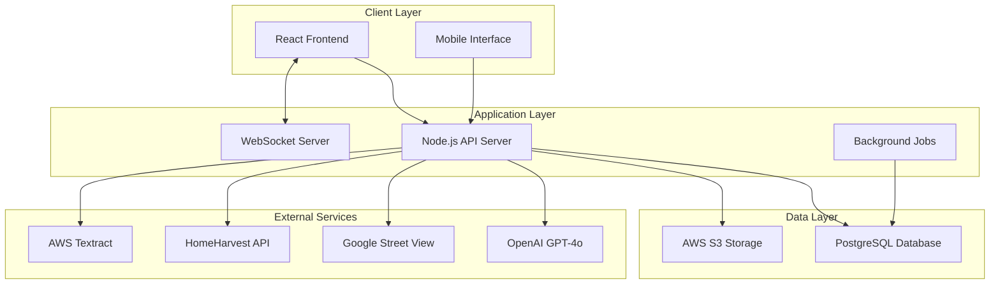

### Technology Stack

**Frontend:**
- React 18 with TypeScript
- Vite for build tooling
- Tailwind CSS for styling
- shadcn/ui component library
- TanStack Table for data grids
- Socket.IO for real-time features

**Backend:**
- Node.js with Express framework
- TypeScript for type safety
- PostgreSQL for primary database
- Socket.IO for WebSocket handling
- AWS S3 for document storage
- Multer for file uploads

**Deployment:**
- Render.com for hosting (separate frontend/backend services)
- Environment-based configuration
- Automated deployment from GitHub

---

## 3. Database Schema & Data Management

NPLVision uses a sophisticated "Current vs. History" data model to optimize both performance and analytical capabilities.

### 3.1. Core Data Philosophy

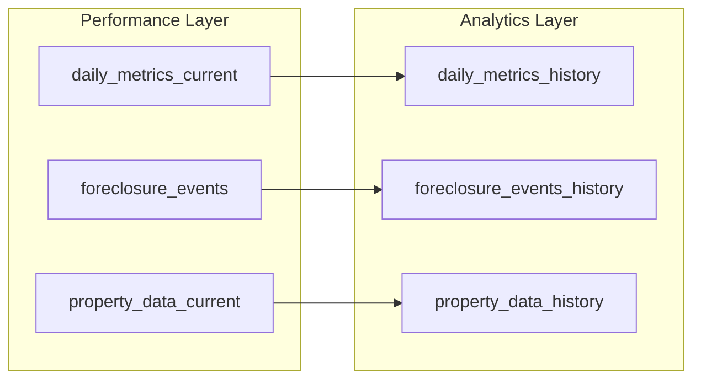

**Current Tables (`_current`):**
- Store only the latest snapshot of each loan
- Optimized for fast UI queries and real-time dashboards
- Single record per loan_id
- Powers the main Loan Explorer interface

**History Tables (`_history`):**
- Store every data point from every upload
- Creates immutable audit trail for trend analysis
- Foundation for predictive modeling and benchmarking
- Enables "Benchmark Flywheel" analytics

### 3.2. Key Database Tables

#### Core Loan Data
- `daily_metrics_current` / `daily_metrics_history` - Financial and status data
- `foreclosure_events` / `foreclosure_events_history` - Foreclosure pipeline tracking
- `property_data_current` / `property_data_history` - Property enrichment data

#### User & Organization Management
- `users` - User accounts and authentication
- `organizations` - Multi-tenant organization data
- `organization_users` - User-organization relationships
- `organization_loan_access` - Loan-level access control

#### Communication & Tasks
- `inbox_items` - Unified inbox for tasks and messages
- `chat_rooms` / `chat_messages` - Real-time chat system
- `notifications` - System-generated notifications

#### AI & Analytics
- `rag_loan_documents` - Document embeddings for AI retrieval
- `ai_conversations` / `ai_messages` - AI chat history
- `sol_calculations` - Statute of limitations tracking

---

## 4. Backend Services & Logic

The backend follows a service-oriented architecture with specialized modules for different business functions.

### 4.1. Data Ingestion Pipeline

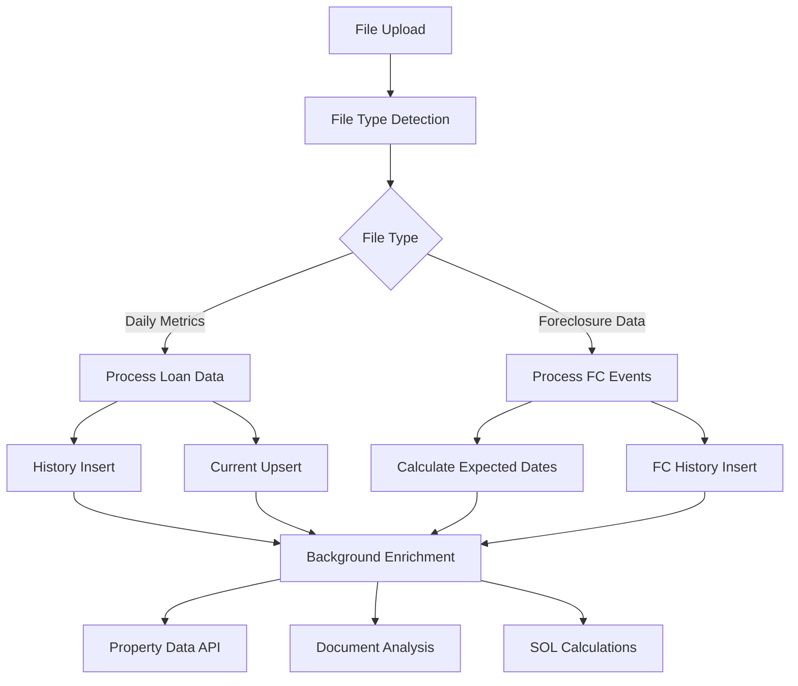

**Key Components:**
- `upload.ts` - Main ingestion endpoint
- `fileTypeDetector.ts` - Automatic file type detection
- `columnMappers.ts` - Data cleaning and mapping
- `currentHistoryService.ts` - Current/history table management

### 4.2. Core Business Services

#### Foreclosure Service (`foreclosureService.ts`)
- State-specific milestone tracking
- Expected vs. actual timeline calculations
- Attorney performance benchmarking
- Timeline visualization data

#### Property Enrichment (`propertyDataService.ts`)
- Multi-source property data aggregation
- Automated valuation updates
- Street View integration
- Rental market analysis

#### SOL Management (`SOLCalculationService.ts`)
- Jurisdiction-specific statute of limitations rules
- Automated expiration monitoring
- Risk assessment and alerts
- Tolling provision tracking

#### Organization Access (`organizationAccessService.ts`)
- Multi-tenant data isolation
- Role-based permissions (owner, servicer, viewer, collaborator)
- Loan-level access control
- API middleware integration

---

## 5. Frontend Interface

The frontend is designed as a responsive, single-page application with a focus on usability and performance.

### 5.1. Layout Structure

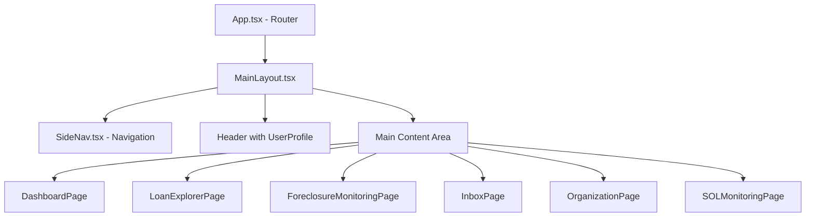

### 5.2. Key Design Principles

**Responsive Design:**
- Desktop-first with mobile adaptations
- Collapsible sidebar navigation
- Touch-friendly interface elements
- Optimized for screens from mobile to 4K

**Component Architecture:**
- Smart containers manage state and API calls
- Dumb components focus on presentation
- Reusable UI components via shadcn/ui
- Consistent styling with Tailwind CSS

**Performance Optimization:**
- Memoized calculations for filtered data
- Lazy loading for large datasets
- Efficient table virtualization
- Real-time updates via WebSocket

---

## 6. Dashboard Pages

NPLVision provides several specialized dashboards for different aspects of portfolio management.

### 6.1. Main Dashboard

**Purpose:** Executive overview of portfolio performance and key metrics

**Key Features:**
- Financial KPI cards (Principal Balance, Average Balance, Total Loans)
- Loan status distribution charts
- Geographic distribution visualization
- Monthly cashflow trends
- Inbox task summary
- Real-time data updates

**Components:**
- `ModernKPICard.tsx` - Animated metric displays
- `LoanStatusChart.tsx` - Status breakdown pie chart
- `GeographicalDistributionChart.tsx` - State-based loan distribution
- `MonthlyCashflowChart.tsx` - Trend analysis

### 6.2. Loan Explorer

**Purpose:** Advanced loan search, filtering, and bulk operations

**Key Features:**
- Dynamic filtering by state, investor, status, balance ranges
- Sortable data table with customizable columns
- Bulk operations (export, task assignment)
- Loan detail modal with comprehensive information
- Real-time data synchronization

### 6.3. Foreclosure Monitoring

**Purpose:** Track foreclosure pipeline and attorney performance

**Key Features:**
- Milestone-based progress tracking
- State-specific benchmarking
- Attorney performance metrics
- Timeline visualization
- Cost and duration analysis
- Expected vs. actual comparisons

### 6.4. SOL Monitoring

**Purpose:** Statute of limitations tracking and compliance

**Key Features:**
- SOL expiration dashboard
- Jurisdiction-specific rules display
- Risk assessment scoring
- Automated alerts and notifications
- Bulk SOL calculations
- Exception reporting

### 6.5. Organization Directory

**Purpose:** Multi-organization user and access management

**Key Features:**
- Organization search and browsing
- User role management
- Department hierarchy display
- Invitation system
- Loan access permissions

---

## 7. Loan Management System

The core of NPLVision's functionality revolves around comprehensive loan lifecycle management.

### 7.1. Loan Explorer Interface

**Primary Features:**
- **Advanced Filtering:** Filter by state, investor, legal status, balance ranges, dates
- **Dynamic Search:** Real-time search across all loan fields
- **Bulk Operations:** Select multiple loans for export or task assignment
- **Column Customization:** Show/hide columns based on user preferences
- **Export Options:** CSV/XLSX export with filtered data

**Data Display:**
- Principal balance with currency formatting
- Last payment dates with aging indicators
- Legal status with color-coded badges
- Geographic information (state, city)
- Foreclosure status integration

### 7.2. Loan Detail Modal/Page

**Comprehensive loan information display organized in tabs:**

**Overview Tab:**
- Borrower information (anonymized)
- Property address and details
- Current balance and payment status
- Investor and servicer information
- Legal status and timeline

**Foreclosure Tab:**
- Interactive timeline visualization
- Milestone progress tracking
- Expected vs. actual dates
- Attorney assignments
- Court information and docket numbers

**Property Tab:**
- Property valuation data
- Google Street View integration
- Rental market analysis
- Neighborhood demographics
- Automated valuation model (AVM) results

**Documents Tab:**
- Document upload interface
- AI-powered document analysis
- Categorized document storage
- Version history tracking
- Bulk upload capabilities

**History Tab:**
- Complete audit trail of changes
- Data upload history
- User action logs
- System-generated events
- Performance metrics over time

### 7.3. Data Upload & Processing

**Supported File Types:**
- CSV files with flexible column mapping
- XLSX files with automatic detection
- Document images (PDF, JPG, PNG)

**Processing Pipeline:**
1. **File Type Detection:** Automatic identification based on headers
2. **Data Validation:** Field validation and error reporting
3. **Column Mapping:** Dynamic mapping to database schema
4. **History Preservation:** All uploads preserved for audit trail
5. **Current State Update:** Latest data updates current tables
6. **Background Enrichment:** Triggers property and SOL updates

---

## 8. Property Enrichment APIs

NPLVision automatically enriches loan data with property information from multiple sources.

### 8.1. Google Street View Integration

**Purpose:** Visual property assessment and neighborhood context

**Features:**
- Real-time Street View panorama rendering
- Coordinate-based property positioning
- Interactive 360-degree views
- Fallback handling for API limitations
- Integration with property detail modals

**Technical Implementation:**
- Google Maps JavaScript API
- Configurable via `VITE_Maps_API_KEY`
- Responsive component design
- Error handling for missing data

### 8.2. HomeHarvest Service (Zillow Integration)

**Purpose:** Automated property valuation and listing data

**Features:**
- Python-based Zillow data extraction
- Property valuation estimates
- Recent sales comparables
- Market trend analysis
- JSON-structured output processing

**Data Points Collected:**
- Current estimated value
- Property details (bedrooms, bathrooms, square footage)
- Lot size and property type
- Recent sales history
- Market appreciation rates

**Database Storage:**
- `property_data_current` - Latest property information
- `property_data_history` - Historical valuation changes
- Automatic timestamping and audit trails

### 8.3. RentCast API (Available but Disabled)

**Purpose:** Rental market analysis and investment property insights

**Potential Features:**
- Rental price estimates
- Market rent comparisons
- Investment property metrics
- Neighborhood rental trends
- Cash flow projections

### 8.4. Property Data Service

**Centralized property data management:**

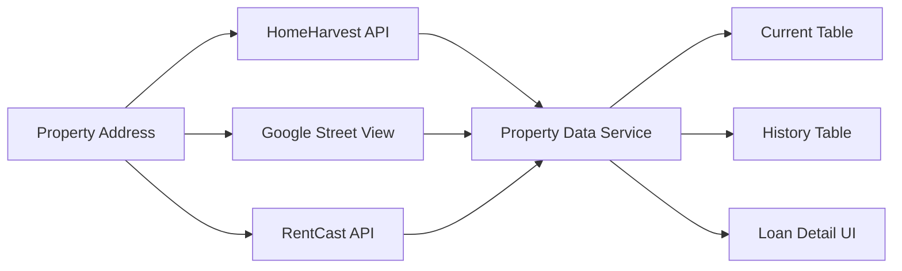

**Key Functions:**
- Multi-source data aggregation
- Duplicate detection and deduplication
- Data quality validation
- Automated refresh scheduling
- API rate limiting and error handling

---

## 9. Inbox & Task Management

NPLVision provides a comprehensive task management system that combines user-generated tasks, system-generated alerts, and communication threads.

### 9.1. Unified Inbox System

**Core Concepts:**
- **Multi-Type Messages:** Support for alerts, tasks, documents, and notifications
- **Priority Management:** Four-level priority system (urgent, high, normal, low)
- **Status Tracking:** Complete lifecycle from unread to archived
- **Threading:** Related messages grouped together
- **Multi-User Assignment:** Tasks can be assigned to multiple users

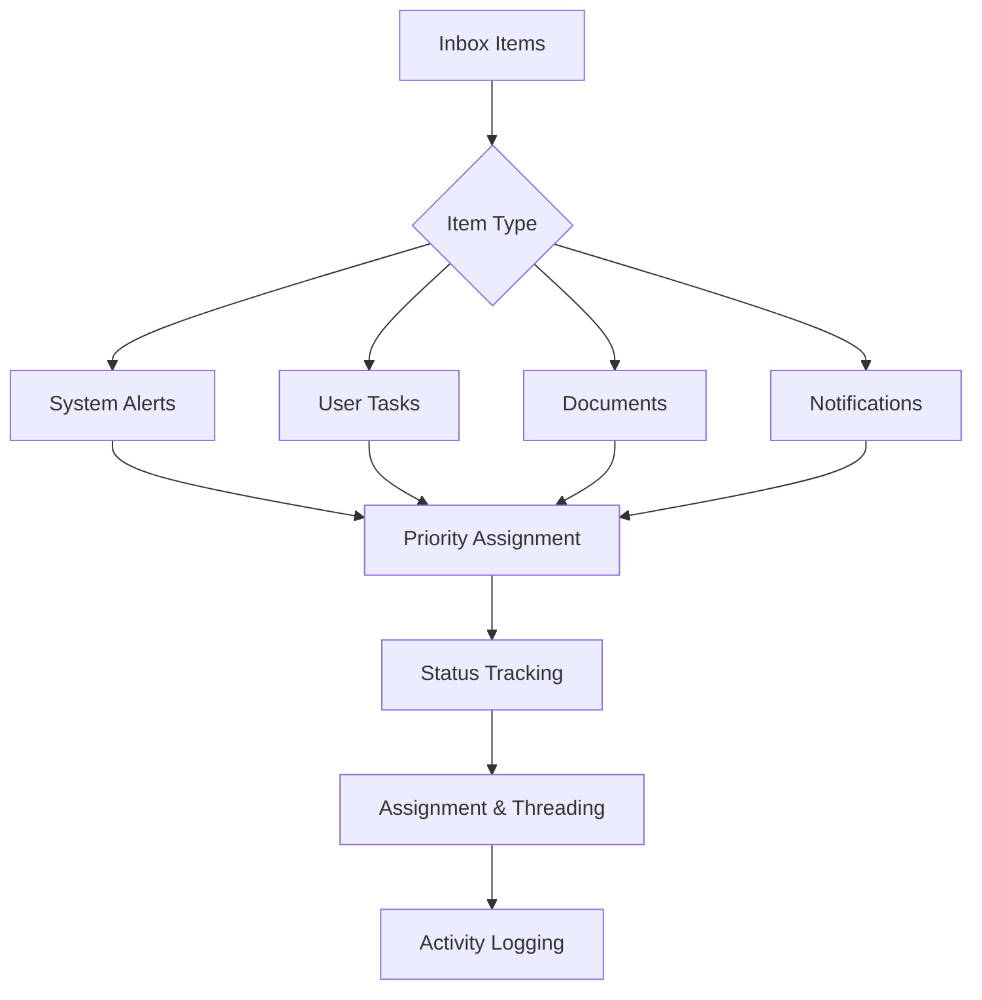

### 9.2. System-Generated Tasks

**Automated Task Creation:**

**Document Upload Alerts:**
- Missing security instruments after 7 days
- Missing title reports after 14 days
- Document expiration notifications

**Foreclosure Milestone Alerts:**
- Overdue milestone notifications
- Expected completion date alerts
- Attorney performance issues

**SOL Monitoring:**
- Approaching expiration warnings
- Jurisdiction rule changes
- Risk assessment updates

**Data Quality Alerts:**
- Missing critical loan information
- Inconsistent data patterns
- Upload validation errors

### 9.3. User Task Management

**Task Creation Features:**
- Rich text descriptions with markdown support
- Due date and duration tracking
- Priority level assignment
- Multiple user assignments
- Loan association and context
- Attachment support

**Task Organization:**
- Filter by status, priority, assignee
- Search across task content
- Bulk operations (mark complete, reassign)
- Sort by due date, priority, creation date
- Archive completed tasks

**Collaboration Features:**
- Task comments and updates
- Assignment notifications
- Status change alerts
- Activity timeline tracking
- Email-style threading

### 9.4. Frontend Interface

**Inbox Page Features:**
- **Modern Card-Based Layout:** Clean, scannable task cards
- **Advanced Filtering:** Filter by type, status, priority, assignee
- **Real-Time Updates:** Live updates via WebSocket connection
- **Quick Actions:** Mark complete, reassign, archive from list view
- **Task Details:** Expandable task cards with full context
- **Bulk Operations:** Select multiple tasks for batch processing

**Integration Points:**
- **Loan Explorer:** Create tasks from loan detail modal
- **Foreclosure Timeline:** Generate milestone-based tasks
- **Document Uploads:** Automatic task creation for missing documents
- **Chat System:** Convert chat messages to actionable tasks

---

## 10. Real-time Chat & Collaboration

NPLVision includes a comprehensive real-time communication system designed for inter-organizational collaboration.

### 10.1. WebSocket Infrastructure

**Core Architecture:**
- Socket.IO server with CORS support
- JWT-based authentication
- Multi-transport support (WebSocket, polling)
- Connection rate limiting (max 5 per user)
- Automatic reconnection handling

**Real-Time Features:**
- Instant message delivery
- Typing indicators
- User presence tracking (online/offline)
- Message reactions and emoji support
- File attachment sharing

### 10.2. Chat System Features

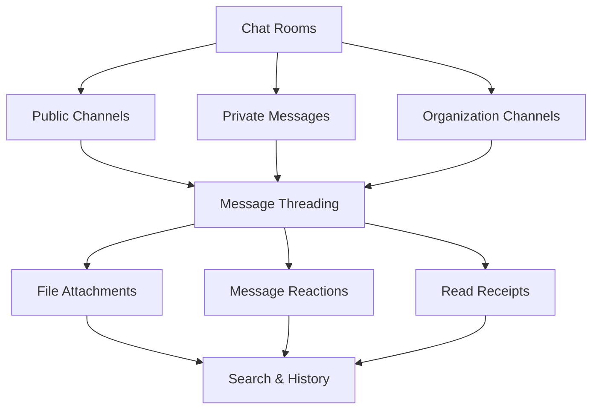

**Room Management:**
- Create public and private chat rooms
- Organization-scoped channels
- User invitation system
- Room-specific permissions
- Archive and search capabilities

**Message Features:**
- Rich text formatting
- File attachment support
- Message editing and deletion
- Reply threading
- Emoji reactions
- Message search and filtering

**User Experience:**
- Real-time typing indicators
- Online status indicators
- Notification badges
- Message history persistence
- Mobile-responsive interface

### 10.3. Integration with Other Systems

**Task Creation:**
- Convert chat messages to actionable tasks
- Assign tasks directly from chat
- Link tasks to specific conversations
- Task status updates in chat

**Loan Context:**
- Associate chat rooms with specific loans
- Share loan details directly in chat
- Property information sharing
- Document sharing and collaboration

**Notification System:**
- Desktop notifications for new messages
- Email notifications for offline users
- Customizable notification preferences
- Priority message alerts

### 10.4. Morgan AI Integration

**AI Assistant in Chat:**
- Natural language queries about loan portfolio
- Contextual responses based on accessible data
- Conversation history preservation
- Rate limiting and usage tracking
- Real-time response generation

---

## 11. Organization & User Management

NPLVision supports multi-tenant architecture with sophisticated organization and user management capabilities.

### 11.1. Organization Structure

**Organization Types:**
- **Servicers:** Manage loans on behalf of investors
- **Investors:** Own loan portfolios
- **Law Firms:** Handle foreclosure proceedings  
- **Asset Managers:** Manage multiple investor portfolios
- **Other:** Custom organization types

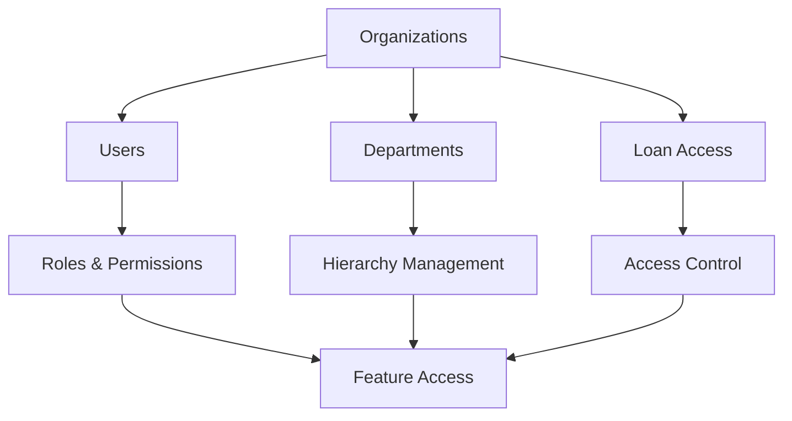

**Organizational Features:**
- Department hierarchy management
- Custom role definitions
- Invitation system with tokens
- User directory and search
- Cross-organization collaboration

### 11.2. Access Control System

**Loan-Level Permissions:**
- **Owner:** Full access and control
- **Servicer:** Operational management rights
- **Viewer:** Read-only access
- **Collaborator:** Limited editing capabilities

**Organization-Level Features:**
- **Organization Directory:** Browse and search other organizations
- **User Management:** Invite, manage, and remove users
- **Department Structure:** Create and manage organizational hierarchy
- **Role Assignment:** Assign specific roles and permissions
- **Loan Portfolio Access:** Control which loans users can access

**Data Isolation:**
- Complete data separation between organizations
- Secure loan access verification
- API-level access control middleware
- Audit trail for access changes

### 11.3. User Interface

**Organization Directory Page:**
- Search organizations by name and type
- View organization details and structure
- Contact information and communication
- Collaboration request system

**User Management:**
- User invitation system
- Role and permission management
- Department assignment
- Activity monitoring
- Session management

**Profile Management:**
- User profile customization
- Notification preferences
- Security settings
- API key management

---

## 12. Foreclosure Timeline Management

NPLVision provides sophisticated foreclosure tracking with state-specific milestone management and benchmarking capabilities.

### 12.1. Timeline Visualization

**Interactive Timeline Features:**
- Visual milestone progression
- Expected vs. actual date comparisons
- Color-coded status indicators
- Attorney assignment tracking
- Court information display
- Document requirement tracking

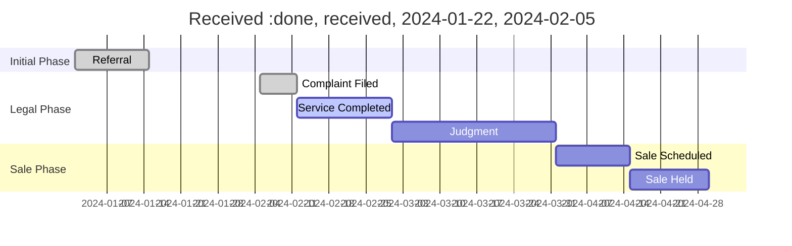

### 12.2. State-Specific Rules Engine

**Foreclosure Rules Management:**
- JSON-based rules configuration (`fcl_milestones_by_state.json`)
- Judicial vs. non-judicial process handling
- State-specific milestone sequences
- Expected timeline calculations
- Attorney performance benchmarks

**Key Data Points:**
- **Milestone Definitions:** State-specific process steps
- **Expected Durations:** Typical timeframes for each milestone
- **Required Documents:** Documentation needed per milestone
- **Court Requirements:** Jurisdiction-specific legal requirements
- **Cost Estimates:** Expected costs per milestone and attorney

### 12.3. Performance Monitoring

**Attorney Performance Tracking:**
- Average milestone completion times
- Cost per milestone analysis
- Success rate tracking
- Comparative benchmarking
- Performance alerts and notifications

**Portfolio-Level Analytics:**
- Foreclosure pipeline status
- Geographic performance variations
- Investor-specific metrics
- Seasonal trend analysis
- Predictive timeline modeling

**Key Performance Indicators:**
- **Average Foreclosure Duration:** Start to sale completion
- **Milestone Adherence:** Expected vs. actual timing
- **Cost Per Foreclosure:** Total cost breakdown
- **Attorney Efficiency:** Comparative performance metrics
- **Success Rate:** Completion vs. abandonment rates

### 12.4. Integration Points

**Data Ingestion:**
- Automated milestone updates from servicer uploads
- Court docket integration capabilities
- Attorney reporting integration
- Document upload linking

**Task Generation:**
- Overdue milestone alerts
- Document requirement notifications
- Attorney performance issues
- Court date reminders

**Reporting:**
- Milestone progress reports
- Attorney performance summaries
- Cost analysis reports
- Timeline prediction reports

---

## 13. Statute of Limitations (SOL)

NPLVision includes comprehensive statute of limitations tracking to ensure regulatory compliance and risk management.

### 13.1. SOL Calculation Engine

**Core Components:**
- Jurisdiction-specific SOL rules
- Multiple trigger event support
- Automated expiration monitoring
- Risk assessment scoring
- Tolling provision tracking

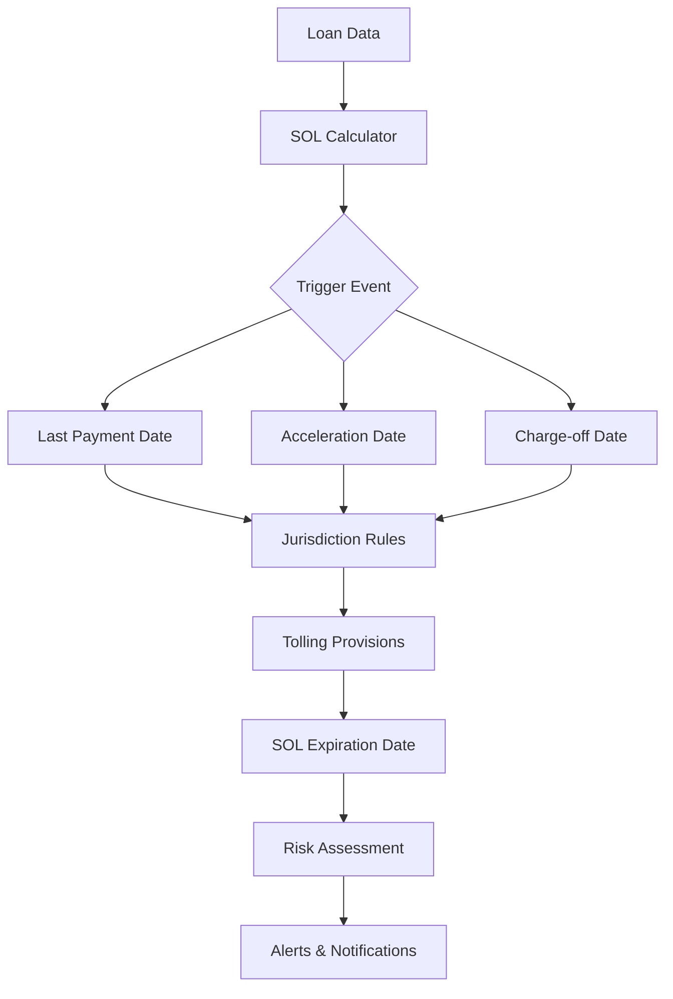

### 13.2. Jurisdiction Management

**State-Specific Rules:**
- Promissory note vs. mortgage instrument SOL periods
- Written vs. oral contract distinctions
- State-specific tolling provisions
- Discovery rule applications
- Partial payment effects

**Key SOL Periods by State:**
- **New York:** 6 years for promissory notes
- **California:** 4 years for written contracts
- **Florida:** 5 years for written contracts
- **Texas:** 4 years for written contracts
- **Pennsylvania:** 4 years for written contracts

**Tolling Provisions:**
- Borrower out-of-state residence
- Bankruptcy filing tolling
- Military service protections
- Acknowledgment of debt
- Partial payment extensions

### 13.3. Risk Assessment

**SOL Status Categories:**
- **Active:** SOL period not yet expired
- **Approaching:** Within 90 days of expiration
- **Critical:** Within 30 days of expiration
- **Expired:** SOL period has passed
- **Tolled:** SOL period suspended due to tolling event

**Risk Scoring Factors:**
- Time remaining until expiration
- Clarity of trigger event date
- Presence of tolling provisions
- Borrower contact history
- Payment activity patterns

### 13.4. Monitoring & Alerts

**Automated Monitoring:**
- Daily SOL status updates
- Approaching expiration alerts (90, 60, 30 days)
- Expiration notifications
- Tolling event detection
- Bulk portfolio analysis

**Alert Types:**
- **Urgent:** SOL expires within 30 days
- **High:** SOL expires within 90 days
- **Medium:** SOL status requires review
- **Low:** SOL calculation updated

**Reporting Capabilities:**
- SOL expiration dashboard
- Risk assessment reports
- Jurisdiction analysis
- Portfolio SOL status
- Exception reporting

### 13.5. Integration Features

**Loan Detail Integration:**
- SOL status display in loan modals
- Historical SOL calculation tracking
- Tolling event documentation
- Risk factor explanations

**Task Management:**
- Automated task creation for approaching expirations
- SOL review task assignments
- Documentation requirement tasks
- Legal action reminders

**Audit Trail:**
- Complete SOL calculation history
- Trigger event documentation
- Tolling provision records
- User action tracking

---

## 14. Document Management & Analysis

NPLVision provides comprehensive document management with AI-powered analysis capabilities.

### 14.1. Document Upload System

**Supported File Types:**
- **Loan Data:** CSV, XLSX files for portfolio uploads
- **Documents:** PDF, DOC, DOCX for loan documentation  
- **Images:** JPG, PNG, TIFF for scanned documents
- **Multi-format:** Automatic format detection and processing

**Upload Process:**
1. **File Validation:** Format and size validation
2. **Virus Scanning:** Security scanning for uploaded files
3. **OCR Processing:** Text extraction from images and PDFs
4. **AI Analysis:** Document classification and data extraction
5. **Storage:** Secure storage in AWS S3
6. **Indexing:** Full-text search indexing

### 14.2. AWS Integration

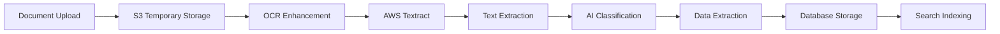

**AWS Services Used:**
- **S3 Storage:** Temporary document storage for processing
- **Textract:** Advanced OCR and document analysis
- **Security:** IAM roles and encrypted storage
- **Cost Optimization:** Automated cleanup of temporary files

### 14.3. OCR Enhancement Service

**Advanced OCR Processing:**
- PDF-to-image conversion for better OCR results
- Python-based enhancement algorithms
- Image quality improvement
- Text recognition optimization
- Multi-page document handling

**Document Enhancement Features:**
- Contrast adjustment
- Noise reduction
- Skew correction
- Resolution optimization
- Character recognition improvement

### 14.4. AI-Powered Document Analysis

**Document Classification:**
- **Mortgage Documents:** Promissory notes, deeds of trust
- **Title Documents:** Title reports, insurance policies
- **Legal Documents:** Court filings, foreclosure notices
- **Financial Documents:** Payment history, statements
- **Property Documents:** Appraisals, inspection reports

**Data Extraction Capabilities:**
- **Loan Terms:** Principal amount, interest rate, maturity date
- **Property Information:** Address, legal description, assessor info
- **Borrower Information:** Names, contact information (anonymized)
- **Payment Details:** Payment history, default dates
- **Legal Information:** Court case numbers, attorney details

**AI Analysis Features:**
- **OpenAI Integration:** GPT-4o for document understanding
- **Structured Output:** JSON format for extracted data
- **Confidence Scoring:** Reliability indicators for extracted data
- **Error Handling:** Graceful fallback for processing failures
- **Batch Processing:** Efficient handling of multiple documents

### 14.5. Document Organization

**Storage Structure:**
- **Loan-Centric:** Documents organized by loan ID
- **Category-Based:** Documents grouped by type and purpose
- **Version Control:** Multiple versions of same document type
- **Access Control:** User and organization-based permissions
- **Search Functionality:** Full-text search across all documents

**Document Metadata:**
- Upload timestamp and user
- Document type and category  
- Processing status and results
- File size and format
- OCR confidence scores
- AI analysis results

---

## 15. Morgan AI Assistant

NPLVision features "Morgan," an advanced AI assistant powered by OpenAI's GPT-4o model, designed specifically for mortgage portfolio analysis and management.

### 15.1. AI Architecture

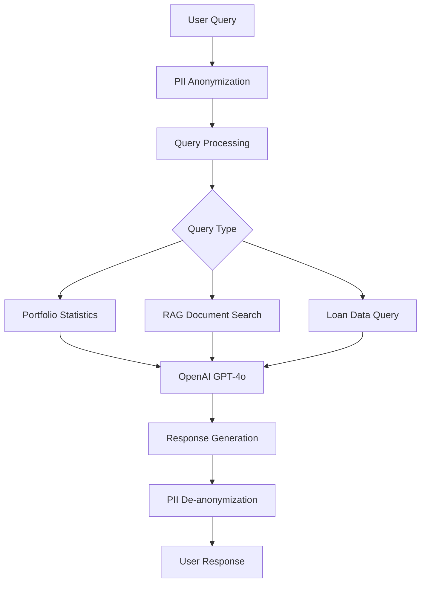

### 15.2. Privacy & Data Protection

**PII Anonymization Process:**
1. **Detection:** Identify personally identifiable information
2. **Replacement:** Replace PII with anonymized tokens
3. **Mapping:** Store secure mappings for de-anonymization
4. **Processing:** Send only anonymized data to AI models
5. **Response:** De-anonymize AI responses before user delivery

**Protected Information:**
- **Names:** PERSON_XXXX placeholders
- **Addresses:** ADDRESS_XXXX placeholders  
- **SSNs:** SSN_XXXX placeholders
- **Phone Numbers:** PHONE_XXXX placeholders
- **Email Addresses:** EMAIL_XXXX placeholders

### 15.3. RAG (Retrieval-Augmented Generation) System

**Efficient AI Processing:**
- **Document Embeddings:** Vector embeddings for semantic search
- **Smart Retrieval:** Retrieve only relevant documents for context
- **Token Optimization:** Reduce context size by ~90% while maintaining accuracy
- **Cost Efficiency:** Significantly lower API costs through targeted retrieval

**Document Types Indexed:**
- **Loan Summaries:** Core loan information and metrics
- **Foreclosure Data:** Timeline and milestone information
- **Property Information:** Valuation and market data
- **SOL Analysis:** Statute of limitations calculations
- **Financial Data:** Payment history and performance metrics

### 15.4. Query Capabilities

**Portfolio Analysis:**
- "What's the average principal balance for loans in California?"
- "Show me loans with no payments in the last 6 months"
- "Which foreclosures are behind schedule in New York?"
- "Compare performance between investors A and B"

**Foreclosure Intelligence:**
- "List overdue foreclosure milestones by attorney"
- "What's the average foreclosure duration in Florida?"
- "Show foreclosures scheduled for sale next month"
- "Compare actual vs. expected foreclosure timelines"

**Risk Assessment:**
- "Which loans have SOL expiring in the next 90 days?"
- "Show high-risk loans by state"
- "What's our exposure in non-judicial foreclosure states?"
- "Identify loans missing critical documentation"

**Market Insights:**
- "Show property value trends by state"
- "Compare portfolio performance to market benchmarks"
- "Identify opportunities for loan modifications"
- "Analyze seasonal payment patterns"

### 15.5. Conversation Management

**Features:**
- **Multi-turn Conversations:** Context-aware follow-up questions
- **Conversation History:** Persistent chat history per user
- **Thread Management:** Organize related queries
- **Export Capabilities:** Export conversation transcripts
- **Search History:** Find previous queries and responses

**Rate Limiting & Usage Tracking:**
- **Daily Query Limits:** Configurable per user/organization
- **Token Consumption Tracking:** Monitor AI usage costs
- **Usage Analytics:** Track most common query types
- **Cost Management:** Automatic alerts for high usage

### 15.6. Integration Points

**Real-time Chat Integration:**
- Morgan available in chat interface
- Seamless switching between AI and human chat
- Share AI insights with team members
- Convert AI responses to actionable tasks

**Dashboard Integration:**
- AI-generated insights on dashboard
- Natural language query interface
- Automated report generation
- Proactive alerts and recommendations

**Loan Detail Integration:**
- Ask questions about specific loans
- Generate loan summaries and insights
- Compare similar loans
- Risk assessment explanations

---

## 16. Security & Access Control

NPLVision implements enterprise-grade security measures to protect sensitive financial data and ensure regulatory compliance.

### 16.1. Authentication & Authorization

**Authentication Methods:**
- **JWT Tokens:** Secure, stateless authentication
- **Password Security:** bcrypt hashing with salt
- **Session Management:** Secure session handling
- **Multi-Factor Authentication:** (Available for configuration)

**Authorization Levels:**
- **System Admin:** Full platform access
- **Organization Admin:** Organization-level management
- **User:** Standard user permissions
- **Viewer:** Read-only access
- **API User:** Programmatic access only

### 16.2. Data Security

**Encryption:**
- **Data in Transit:** TLS 1.2+ for all communications
- **Data at Rest:** Encrypted database storage
- **API Security:** Encrypted API communications
- **File Storage:** Encrypted S3 bucket storage

**Access Control:**
- **Role-Based Access Control (RBAC):** Granular permission system
- **Multi-Tenant Isolation:** Complete data separation
- **Loan-Level Permissions:** Specific loan access control
- **API Rate Limiting:** Prevent abuse and attacks
- **Audit Logging:** Complete access and action tracking

### 16.3. Compliance & Privacy

**Data Privacy:**
- **PII Protection:** Automatic anonymization for AI processing
- **Data Minimization:** Store only necessary information
- **Consent Management:** User consent tracking
- **Right to Deletion:** Data removal capabilities
- **Data Portability:** Export user data capabilities

**Audit & Compliance:**
- **Complete Audit Trail:** All user actions logged
- **Data Lineage:** Track data flow and transformations
- **Compliance Reporting:** Generate compliance reports
- **Change Tracking:** Monitor all data modifications
- **Access Logging:** Log all data access attempts

### 16.4. Infrastructure Security

**Network Security:**
- **CDN Protection:** Cloudflare integration for DDoS protection
- **SSL/TLS:** End-to-end encryption
- **Secure Headers:** Security-focused HTTP headers
- **CORS Configuration:** Strict cross-origin policies

**Application Security:**
- **Input Validation:** Comprehensive input sanitization  
- **SQL Injection Protection:** Parameterized queries
- **XSS Prevention:** Content Security Policy implementation
- **CSRF Protection:** Token-based CSRF protection
- **Security Headers:** Implement security best practices

**Monitoring & Alerting:**
- **Security Monitoring:** Real-time security event monitoring
- **Anomaly Detection:** Unusual access pattern detection
- **Alert System:** Immediate notification of security events
- **Incident Response:** Automated response procedures
- **Vulnerability Management:** Regular security assessments

---

## Conclusion

NPLVision represents a comprehensive solution for non-performing loan portfolio management, combining advanced analytics, artificial intelligence, real-time collaboration, and automated workflows into a unified platform. The system is designed to scale with growing portfolios while maintaining security, performance, and ease of use.

**Key Benefits:**
- **Operational Efficiency:** Automated workflows reduce manual tasks
- **Data-Driven Decisions:** AI-powered insights and analytics
- **Regulatory Compliance:** Built-in SOL tracking and compliance tools
- **Team Collaboration:** Real-time communication and task management
- **Portfolio Intelligence:** Comprehensive reporting and benchmarking
- **Scalable Architecture:** Handles portfolios from hundreds to thousands of loans

**Future Roadmap:**
- Enhanced predictive analytics and machine learning models
- Additional third-party integrations (court systems, title companies)
- Mobile application for field access
- Advanced reporting and business intelligence tools
- API ecosystem for partner integrations

For technical support or feature requests, contact the NPLVision development team or refer to the platform's help documentation within the application.