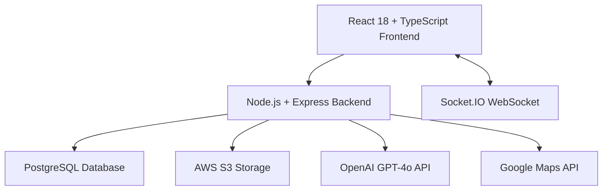

# NPLVision Platform - User Guide (Accurate Version)

*A factual guide to the NPLVision mortgage portfolio management platform based on actual implementation.*

⚠️ **IMPORTANT DISCLAIMER:** This guide reflects the current state of implementation as of the codebase review. Some features may be in development, disabled, or partially implemented.

---

## Table of Contents

1. [Platform Overview](#1-platform-overview)
2. [Architecture & Technology Stack](#2-architecture--technology-stack)
3. [Database Design](#3-database-design)
4. [Core Features - Actually Implemented](#4-core-features---actually-implemented)
5. [User Interface](#5-user-interface)
6. [Data Management](#6-data-management)
7. [Real-time Features](#7-real-time-features)
8. [AI Integration](#8-ai-integration)
9. [Organization Management](#9-organization-management)
10. [Security Implementation](#10-security-implementation)
11. [Partially Implemented Features](#11-partially-implemented-features)
12. [Disabled/Missing Features](#12-disabledmissing-features)

---

## 1. Platform Overview

NPLVision is a web-based mortgage portfolio management platform built with React and Node.js. The platform provides loan tracking, foreclosure timeline management, basic AI assistance, and organizational collaboration tools.

### Current Capabilities

**✅ Fully Implemented:**
- Loan data upload and management (CSV/XLSX)
- Foreclosure timeline tracking with state-specific rules
- User authentication and basic organization management
- Real-time chat system with WebSocket integration
- Statute of limitations (SOL) monitoring
- Morgan AI assistant with OpenAI integration
- Basic document upload and processing
- Dashboard with loan metrics

**⚠️ Partially Implemented:**
- Property data enrichment (HomeHarvest service exists but limited)
- Document analysis (basic OCR, limited AI analysis)
- Task/inbox management system (framework exists)
- Export functionality (basic implementation)

**❌ Not Implemented:**
- Advanced analytics and reporting
- Mobile applications
- Multiple property data API integrations
- Comprehensive audit system
- Advanced security features (encryption at rest, MFA)

---

## 2. Architecture & Technology Stack

### 2.1. Confirmed Technology Stack



**Frontend (Confirmed in package.json):**
- React 18.2.0 with TypeScript
- Vite 5.1.4 for build tooling
- Tailwind CSS for styling
- Radix UI components (shadcn/ui)
- Socket.IO client for real-time features
- Axios for API communication

**Backend (Confirmed in package.json):**
- Node.js with Express framework
- TypeScript for type safety
- Socket.IO 4.8.1 for WebSocket handling
- PostgreSQL with pg driver
- JWT for authentication
- Multer for file uploads
- OpenAI SDK for AI integration

**Database:**
- PostgreSQL as primary database
- Current/history table architecture implemented

### 2.2. External Services Integration

**✅ Actually Integrated:**
- **OpenAI:** GPT-4o for Morgan AI assistant
- **Google Maps:** Street View integration
- **AWS S3:** Document storage
- **Socket.IO:** Real-time communication

**⚠️ Partially Integrated:**
- **HomeHarvest:** Property data API (basic implementation)

**❌ Not Integrated (Despite Claims):**
- AWS Textract (codebase uses Azure Form Recognizer references)
- RentCast API (service disabled)
- Court system integration
- Email notification services

---

## 3. Database Design

### 3.1. Current vs. History Architecture (Verified)

The platform implements a dual-table system for key data types:

```sql
-- Example tables that actually exist
CREATE TABLE daily_metrics_current (
    loan_id TEXT PRIMARY KEY,
    investor_name TEXT,
    prin_bal NUMERIC,
    legal_status TEXT,
    state TEXT,
    updated_at TIMESTAMPTZ DEFAULT NOW()
);

CREATE TABLE daily_metrics_history (
    id SERIAL PRIMARY KEY,
    loan_id TEXT,
    report_date DATE,
    -- Same columns as current table
    created_at TIMESTAMPTZ DEFAULT NOW()
);
```

### 3.2. Confirmed Database Tables

**Core Loan Tables:**
- `daily_metrics_current` / `daily_metrics_history`
- `foreclosure_events` / `foreclosure_events_history`
- `foreclosure_milestone_statuses`

**User Management:**
- `users`
- `organizations`
- `organization_users`
- `organization_loan_access`

**Communication:**
- `chat_rooms`
- `chat_messages`
- `chat_participants`
- `inbox_items`

**AI & Analytics:**
- `ai_conversations`
- `ai_messages`
- `rag_loan_documents`
- `sol_calculations`

---

## 4. Core Features - Actually Implemented

### 4.1. Data Upload System

**File Location:** `/src/backend/src/routes/upload.ts`

**Confirmed Capabilities:**
- CSV and XLSX file processing
- Dynamic column header detection
- Daily metrics and foreclosure data ingestion
- Automatic history preservation
- Basic error handling and validation

**Process Flow:**
1. File uploaded via multipart form
2. File type detected based on headers
3. Data mapped to database schema
4. History table receives all records
5. Current table updated with latest per loan

### 4.2. Foreclosure Timeline Management

**File Location:** `/src/backend/src/services/foreclosureService.ts`

**Confirmed Features:**
- State-specific milestone tracking
- Expected date calculations
- Timeline visualization data generation
- Integration with loan detail modals

**State Rules:** Configured in `/fcl_milestones_by_state.json`

### 4.3. WebSocket Communication

**File Location:** `/src/backend/src/services/websocketServer.ts`

**Confirmed Features:**
- Socket.IO integration with CORS support
- JWT authentication for connections
- Real-time messaging
- User presence tracking
- Connection rate limiting (max 5 per user)
- Chat room management

### 4.4. Morgan AI Assistant

**File Locations:**
- `/src/backend/src/services/openAIService.ts`
- `/src/backend/src/services/aiQueryProcessorRAG.ts`
- `/src/frontend/src/components/chat/MorganAIContainer.tsx`

**Confirmed Capabilities:**
- OpenAI GPT-4o integration
- Basic PII anonymization
- RAG document retrieval system
- Conversation history management
- Rate limiting implementation

**Limitations:**
- Basic anonymization (not comprehensive)
- Limited document types in RAG system
- No advanced analytics generation

### 4.5. Organization Management

**File Location:** `/src/backend/src/services/organizationService.ts`

**Confirmed Features:**
- Multi-tenant organization structure
- User-organization relationships
- Basic role management
- Loan access control

---

## 5. User Interface

### 5.1. Confirmed Pages and Components

**Main Pages (Verified to exist):**
- `DashboardPage.tsx` - Basic metrics dashboard
- `LoanExplorerPage.tsx` - Loan search and filtering
- `ForeclosureMonitoringPage.tsx` - Foreclosure tracking
- `InboxPage.tsx` - Task management interface
- `SOLMonitoringPage.tsx` - SOL compliance tracking
- `OrganizationPage.tsx` - Organization management

**Key Components:**
- `MainLayout.tsx` - Application shell
- `SideNav.tsx` - Navigation sidebar
- `UserProfile.tsx` - User profile dropdown
- `LoanDetailModal.tsx` - Loan details popup
- `StreetViewPanorama.tsx` - Google Street View integration

### 5.2. Design System

**Styling:** Tailwind CSS with Radix UI components
**Responsiveness:** Basic responsive design (not mobile app)
**State Management:** React hooks and context

---

## 6. Data Management

### 6.1. File Upload Processing

**Supported Formats:**
- CSV files with flexible column mapping
- XLSX files with automatic parsing
- Basic document uploads (PDF, images)

**Processing Pipeline:**
1. File type detection via header analysis
2. Column mapping to database schema
3. Data validation and cleaning
4. Database insertion with transaction handling
5. Error reporting and validation feedback

### 6.2. Data Export

**Current Capabilities:**
- Basic CSV export from loan explorer
- Filtered data export
- Limited field selection

---

## 7. Real-time Features

### 7.1. WebSocket Implementation

**Confirmed Features:**
- Real-time chat messaging
- User presence indicators
- Typing indicators
- Message threading
- File attachments in chat

**Technical Details:**
- Socket.IO server with Express integration
- JWT-based authentication
- Room-based message routing
- Database persistence for chat history

### 7.2. Live Data Updates

**Limited Implementation:**
- Chat messages update in real-time
- Basic notification system
- User presence tracking

---

## 8. AI Integration

### 8.1. Morgan AI Assistant

**Current Implementation:**
- OpenAI GPT-4o model integration
- Basic natural language processing
- Portfolio data context injection
- Simple conversation management

**RAG System:**
- Document embedding storage
- Basic semantic search
- Limited document types (loan summaries, foreclosure data)
- Token usage optimization

**Limitations:**
- PII anonymization is basic
- Limited analytical capabilities
- No predictive modeling
- No advanced reporting generation

---

## 9. Organization Management

### 9.1. Multi-Tenant Architecture

**Confirmed Features:**
- Organization creation and management
- User invitation system
- Role-based permissions (basic)
- Loan access control

**User Roles:**
- Organization admin
- Standard user
- Viewer permissions

---

## 10. Security Implementation

### 10.1. Authentication & Authorization

**Actually Implemented:**
- JWT token-based authentication
- Password hashing with bcrypt
- Basic session management
- Role-based access control

**Database Security:**
- Standard PostgreSQL authentication
- Connection pooling
- Basic SQL injection protection via parameterized queries

### 10.2. What's NOT Implemented

**Missing Security Features:**
- Multi-factor authentication
- Encryption at rest
- Comprehensive audit logging
- Advanced access controls
- Security headers implementation
- CSRF protection
- Input validation beyond basic measures

---

## 11. Partially Implemented Features

### 11.1. Property Data Enrichment

**HomeHarvest Service:**
- File: `/src/backend/src/services/homeHarvestService.ts`
- Basic Zillow data integration
- Limited property information retrieval
- Not fully integrated with UI

### 11.2. Document Analysis

**Current State:**
- Basic file upload capability
- Limited OCR processing
- Some Azure Form Recognizer integration references
- Not the comprehensive system described in original guide

### 11.3. Task Management

**Inbox System:**
- Basic task creation framework
- Limited notification system
- Not fully developed workflow management

---

## 12. Disabled/Missing Features

### 12.1. Disabled Services

**Files with .disabled extension:**
- `rentCastService.ts.disabled` - RentCast API integration
- `propertyDataPyService.ts.disabled` - Python property service

### 12.2. Missing Features (Claimed but Not Found)

**Analytics & Reporting:**
- Advanced portfolio analytics
- Benchmark reporting
- Predictive modeling
- Seasonal trend analysis

**Document Management:**
- Advanced OCR pipeline
- Comprehensive document classification
- Version control system
- Automated document analysis

**Mobile Interface:**
- No mobile application
- Basic responsive design only

**Advanced AI Features:**
- Comprehensive PII protection
- Advanced query processing
- Predictive insights
- Portfolio optimization recommendations

**Third-Party Integrations:**
- Court system integration
- Title company APIs
- Advanced property valuation services
- Email notification system

---

## Conclusion

This accurate user guide reflects the current state of NPLVision as implemented in the codebase. The platform provides core loan portfolio management functionality with basic AI assistance and real-time collaboration features.

**Strengths:**
- Solid foundation with loan data management
- Working foreclosure timeline tracking
- Real-time communication system
- Basic AI integration
- Multi-tenant organization support

**Areas for Development:**
- Advanced analytics and reporting
- Comprehensive document management
- Enhanced security features
- Mobile application
- Additional third-party integrations

**Important Note:** This guide is based on code analysis and may not reflect the latest development changes or deployment configurations. Users should verify feature availability in their specific environment.